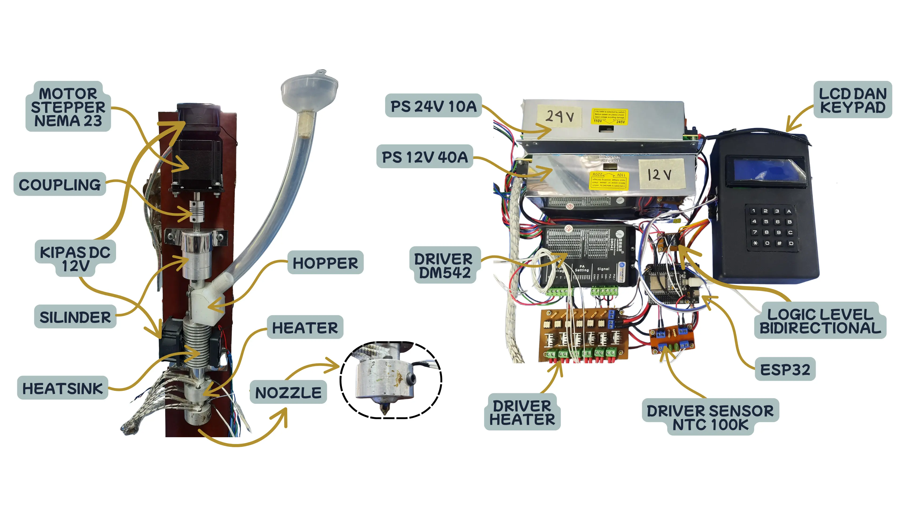

# 3d-print-Extruder-System
development of a extruder systen for a 2x2x2 bilateral 3d printer that can control the temperature to extrude a HDPE plastic seed and extrusion speed by controlling the NEMA23 stepper motor speed.
# preview
</img>
